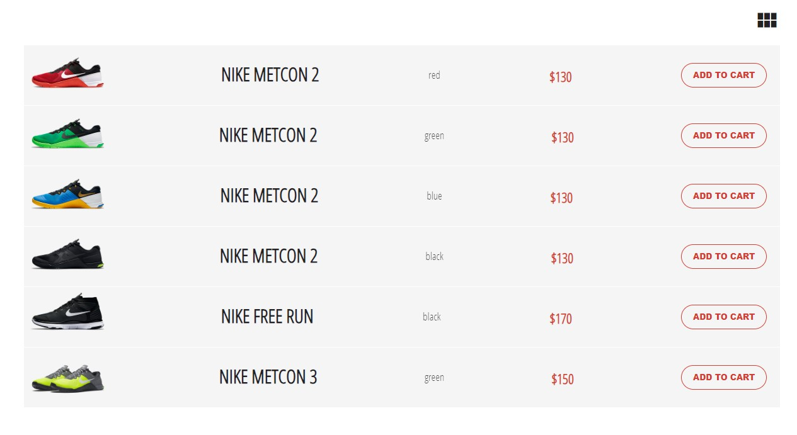
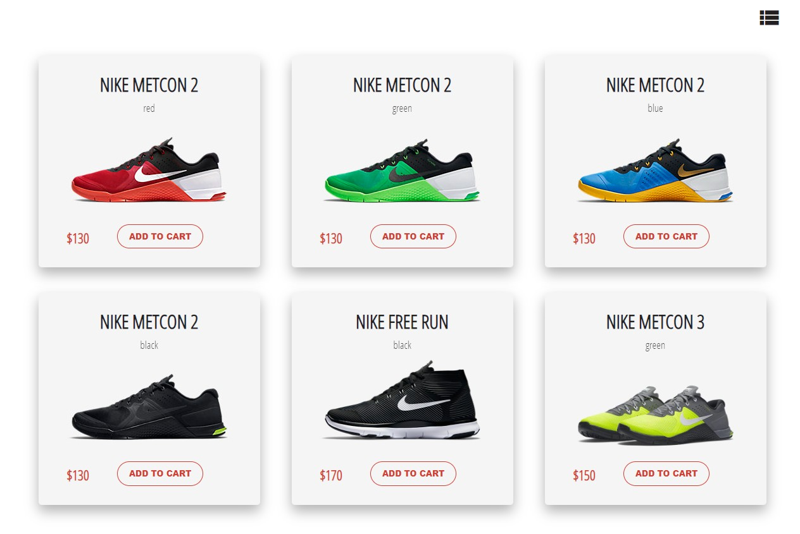

# Расположение товаров

Учебный проект курса [React для JS-разработчиков](https://netology.ru/programs/react)

## **Задача**

Создание приложения для отображения товаров в интернет-магазине. Необходимо, чтобы пользователь мог увидеть товары в виде карточек или в виде списка, в зависимости от того, какое расположение он выберет.

## **Описание проекта**

Реализован компонент `Store`, который управляет состоянием приложения, хранит список товаров в атрибуте `products`.

Иконка разметки, которая указывает на переключение между типами расположения товаров, реализована в компоненте без состояния `IconSwitch`, которому от `Store` передаются два свойства:

* `icon` — название иконки, которую необходимо показать. Название иконки соответствует названию класса из библиотеки ***material icons***. В нашем случае это либо `view_list`, либо `view_module`.
* `onSwitch()` — обработчик события, который реагирует на нажатие пользователем на иконку.

Сами товары отображаются в компонентах без состояния `CardsView` или `ListView`.

Компоненту `CardsView` от `Store` передается свойство `cards` — массив с данными, каждый элемент из которого затем уже отображается с помощью карточки товара `ShopCard`.

То есть `CardsView` отображает много карточек `ShopCard`. На один товар — одна карточка `ShopCard`.

Компоненту `ListView` от `Store` передается всего одно свойство `items` — массив с данными, каждый элемент из которого затем уже отображается с помощью `ShopItem` для товаров, которые мы хотим отобразить.

То есть `ListView` отображает много `ShopItem`. На один товар — один `ShopItem`.

Чтобы компонент `Store` мог реагировать на выбор пользователем вида разметки, в класс `Store` добавлено состояние (state).

В ходе выполнения проекта решены следующие задачи:

* установлено состояние выбранного типа разметки в обработчике события, который `Store` передаёт в свойство `onSwitch` компонента `IconSwitch`;
* из компонента `Store` передана правильная иконка в свойство `icon` компонента `IconSwitch`;
* в компоненте `Store` отображены товары в компоненте `CardsView` или `ListView` соответсвенно состоянию компонента `App`.
## **Стек технологий**

## [**Демо**](https://layouts-ten.vercel.app/)
